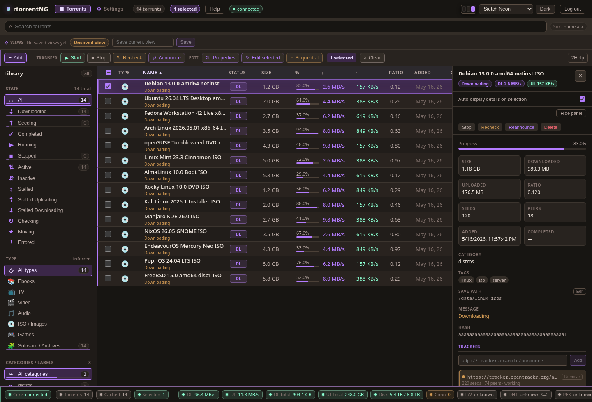

# TorrentNG

[](https://discord.gg/4ub88HeHFm)

TorrentNG is a universal-compatibility torrent stack for headless servers. The
goal is to be the torrent client you can move into or out of without losing
workflow, state, automation, or client choice: import existing libraries, expose
familiar APIs, interoperate with other clients, and run a native Rust engine when
you are ready to replace the old core.

The stack includes a native Rust BitTorrent daemon, a React WebUI,
automation-friendly APIs, migration/import tooling, compatibility facades for
major client ecosystems, and a harness for existing rTorrent deployments.

The project currently supports two engine modes:

| Mode | Process | Source of truth | Use when |
|---|---|---|---|
| Native engine | `torrentngd` | TorrentNG Rust engine and SQLite state | You want the primary rewrite path, native storage/recheck/jobs, and one model for WebUI plus APIs |
| rTorrent sidecar | `rTorrent` + `torrentng` | rTorrent session state | You need an rTorrent migration bridge, compatibility comparison, or an rTorrent-backed deployment |

Both modes aim to expose the same user-facing WebUI and compatibility surfaces.
The compatibility target is intentionally broad: qBittorrent-style endpoints for
common automation tools, Transmission and Deluge RPC facades, rTorrent migration
and interop support, and import paths for the client state formats operators are
likely to have accumulated over time.



Screenshot uses mocked Linux ISO torrent data, not a live user session.

## Status

The native Rust engine is the primary development and deployment path. The
rTorrent-backed sidecar remains supported for migration, comparison, and users
who still want the upstream rTorrent core.

TorrentNG is pre-1.0 software. APIs, configuration, and deployment details can
still change. Universal compatibility is the product goal and release bar, not a
blanket claim that every surface is complete today. Current support, partial
coverage, no-op compatibility shapes, and gaps are tracked in
[docs/CLIENT_COMPATIBILITY_MATRICES.md](docs/CLIENT_COMPATIBILITY_MATRICES.md).
Track current native-engine work in
[docs/ENGINE_REWRITE_BURNDOWN.md](docs/ENGINE_REWRITE_BURNDOWN.md), and use
[docs/ENGINE_REWRITE.md](docs/ENGINE_REWRITE.md) for the practical native vs.
rTorrent guide.

## Quick Start

Start the native engine stack:

```sh
docker compose -f deploy/native/compose.yml up --build
```

Open the WebUI at:

```text
http://localhost:8080
```

Useful native endpoints:

```text
http://localhost:8080/health
http://localhost:8080/api/v1/torrents
http://localhost:8080/api/qb/v2/torrents/info
http://localhost:8080/metrics
```

Add observability with Prometheus and Grafana:

```sh
docker compose -f deploy/native/compose.yml --profile observability up --build
```

## Migrate In And Out

No lock-in: `torrentngd` has first-class subcommands to move a whole library
**into** the native engine and back **out** to another client. Both default to
a read-only dry-run with a fidelity summary; `--apply` performs the change.

```sh
# Import an existing client's state (read-only source; --apply to write)
torrentngd migrate --source qbittorrent --from ~/.local/share/qBittorrent/BT_backup --apply
torrentngd migrate --source rtorrent --from ~/.rtorrent-session --remap /old=/data --apply

# Leave for another client, keeping seeding state where the format allows it
torrentngd export --format libtorrent   --to /tmp/leaving --apply   # qBittorrent/Deluge
torrentngd export --format transmission --to /tmp/leaving --apply
torrentngd export --format generic      --to /tmp/leaving --apply   # universal valve
```

Supported both directions: qBittorrent, Deluge, Transmission, rTorrent,
uTorrent/BitTorrent Classic, BiglyBT/Vuze, and a generic `.torrent` + manifest
path. Tixati imports metadata (its progress format is proprietary; `generic`
is its exit). libtorrent/Transmission/uTorrent/BiglyBT carry the full piece
map so completed *and* in-progress torrents resume without a full recheck;
rTorrent is recheck-free for complete torrents. Dry-run and post-apply
summaries bucket every torrent as recheck-free / complete-only /
metadata-only / torrent-only. See
[docs/MIGRATION.md](docs/MIGRATION.md) for the full guide, fidelity rules, and
rollback.

## rTorrent Mode

Start the rTorrent-backed stack when you need the historical engine path:

```sh
docker compose -f deploy/docker/compose.yml up --build
```

This runs rTorrent plus the `torrentng` sidecar. The sidecar talks to rTorrent
over a trusted local SCGI/XMLRPC socket, maintains a cache, serves the WebUI,
and exposes native and qBittorrent-compatible APIs.

The lower-level Phase 1 rTorrent/ruTorrent bundle is still available for
rTorrent profile testing:

```sh
docker compose -f deploy/docker/compose.phase1.yml up --build
```

Do not share native session state and rTorrent session directories. If you test
both modes against the same payload data, keep separate state volumes and stop
one stack before starting the other unless you intentionally change ports.

## What Is Included

- Native Rust engine crates for bencode, metainfo, hashing, storage, trackers,
  DHT, uTP, peer wire, piece picking, session state, jobs, migration, metrics,
  and API projections.
- `torrentngd`, the native daemon that owns torrent state and serves APIs.
- `sidecar/torrentng`, the rTorrent compatibility harness for existing
  deployments.
- React, TypeScript, and Vite WebUI in `webui/`.
- Docker Compose, Dockerfile, systemd, Kubernetes, nginx, Prometheus, and
  Grafana examples under `deploy/`.
- Certification, interoperability, security review, and soak scripts under
  `scripts/`.

## Repository Map

| Path | Purpose |
|---|---|
| `crates/` | Native engine, API, migration, metrics, and testkit crates |
| `crates/torrentngd/` | Native daemon binary |
| `sidecar/` | rTorrent-backed API/WebUI sidecar |
| `webui/` | React/Vite frontend |
| `deploy/native/` | Native engine Compose, Docker, systemd, Kubernetes, metrics assets |
| `deploy/docker/` | rTorrent sidecar and Phase 1 rTorrent/ruTorrent deployment assets |
| `deploy/certification/` | Integration certification stack |
| `engine-profile/` | rTorrent profile and operational defaults |
| `docs/` | Architecture, API, deployment, migration, security, and roadmap docs |
| `scripts/` | Certification, interop, health, release, and operations scripts |

## Development

Build the native Rust workspace:

```sh
cargo build
```

Run Rust tests:

```sh
cargo test
```

Build the rTorrent sidecar:

```sh
cd sidecar
cargo build
```

Build the WebUI:

```sh
cd webui
npm install
npm run build
```

Run WebUI linting:

```sh
cd webui
npm run lint
```

Run native certification:

```sh
scripts/native_engine_certification_report.sh
```

Run the cross-client interoperability matrix:

```sh
scripts/interop_matrix.sh --local
scripts/interop_matrix.sh --public
```

The matrix runs `torrentngd` beside qBittorrent, Transmission, Deluge,
rTorrent, opentracker, and a fixture HTTP server. Local mode verifies
deterministic client-to-client transfers, webseeds, explicit private peers,
restart recovery, churn, protocol rows for UDP trackers and qBit mutation
compatibility, experimental magnet coverage, and API facade health. Public mode
resolves official Debian, Ubuntu, and Fedora torrents at runtime and fully
downloads them by default. See [docs/INTEROP_MATRIX.md](docs/INTEROP_MATRIX.md)
for the full coverage table and release-gate commands.

## Documentation

Start with the docs index:

- [Docs index](docs/README.md)
- [Engine rewrite guide](docs/ENGINE_REWRITE.md)
- [Native deployment](docs/NATIVE_DEPLOYMENT.md)
- [Track 1 rTorrent deployment](docs/DEPLOYMENT.md)
- [Configuration](docs/CONFIGURATION.md)
- [API reference](docs/API.md)
- [Interop matrix](docs/INTEROP_MATRIX.md)
- [Migration](docs/MIGRATION.md)
- [Architecture](docs/ARCHITECTURE.md)
- [Threat model](docs/THREAT_MODEL.md)

## Support

Project support, setup help, integration discussion, and development updates are
available on Discord:

```text
https://discord.gg/4ub88HeHFm
```

## Legal Use

TorrentNG is intended for lawful content distribution, personal data
management, and legitimate automation workflows. The project does not condone
copyright infringement or unauthorized access to content. Users are responsible
for understanding and following the laws and licenses that apply to the content
they download, seed, or manage.

## License

TorrentNG is dual-licensed under `AGPL-3.0-or-later OR Commercial`.

Unless you have a separate signed commercial license, your use of this software
is governed by the GNU Affero General Public License v3.0 or later. Commercial
licensing is available for users who need terms outside the AGPL.

See [LICENSE](LICENSE) for details.

## Attribution

TorrentNG interoperates with rTorrent, qBittorrent-compatible clients, and
common automation tools in the BitTorrent ecosystem. Product and project names
mentioned in this repository are trademarks or property of their respective
owners. This project is not affiliated with, endorsed by, or sponsored by
rTorrent, qBittorrent, or third-party automation projects unless explicitly
stated.
