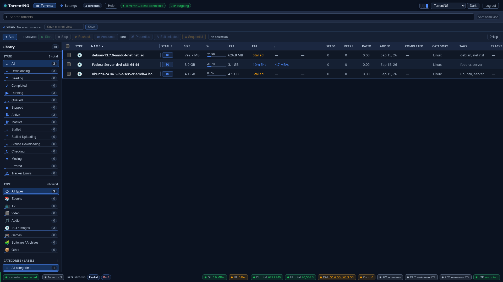

# TorrentNG

TorrentNG gives you one browser interface for supported torrent clients. You
can connect it to a client you already run, or use its own built-in BitTorrent
engine.

It runs on your computer or server. There is no hosted TorrentNG account. The
files stay on the storage you configure.



## Is it useful for you?

TorrentNG may help if you manage torrents on a home server, NAS, or other
self-hosted machine and want to control them from one browser page. It can also
provide familiar automation APIs for supported clients.

If you already have a client and are happy with its interface, TorrentNG adds
another service to set up and maintain. If you want a simple desktop app that
works out of the box, this project is not that.

## Choose how to run it

| Your situation | Choose | What stays in charge of downloads? |
|---|---|---|
| You already use qBittorrent, rTorrent, Transmission, or Deluge and want a shared interface | **Connect an existing client** | Your existing client keeps its files and runs transfers. TorrentNG provides the WebUI and API. |
| You are starting fresh or want TorrentNG to run transfers itself | **TorrentNG Engine** | `torrentngd` manages transfers, storage, and saved state. |

The Engine quick start is below. To connect an existing client, start with the
[compatible-client deployment guide](docs/DEPLOYMENT.md). The two modes use
different services and configuration.

## Try the TorrentNG Engine

You need Docker with Docker Compose v2 and OpenSSL. This starts the Engine on
your own machine and keeps its state and downloads in Docker volumes.

From the repository directory, create a private token file and start TorrentNG:

```sh
umask 077
printf 'TORRENTNG_API_TOKEN=%s\n' "$(openssl rand -hex 32)" > .env
docker compose --env-file .env -f deploy/native/compose.yml up --build
```

Open [http://localhost:28082](http://localhost:28082). At the login screen,
enter the value after `TORRENTNG_API_TOKEN=` from `.env` in either field. Keep
`.env` private; the same token is needed if you recreate the container. The
file is ignored by Git.

The WebUI is available only from this machine by default. Port `44444` is open
for BitTorrent peers. To let another person reach the WebUI, set up an
authenticated HTTPS reverse proxy first; see the
[Engine deployment guide](docs/NATIVE_DEPLOYMENT.md).

To stop the service, press Ctrl+C. The named volumes keep your downloads and
settings. **Do not add `-v` to `docker compose down` unless you intend to delete
those volumes.**

## Before using a real library

TorrentNG is pre-1.0. Settings and APIs may change. Back up your client state
and downloaded files before importing, moving, or deleting data. Migration
starts with a report; review it before using `--apply`. Some imported progress
may need a full data check before another client can resume it.

The latest named 24-hour report covers an idle daemon with no torrents
transferring, but it does not record the source commit. It is not proof for the
code in this checkout. One public Debian torrent transfer is documented. These
results do not establish performance under a busy swarm or compatibility with
every client, tracker, disk, or network. The project does not claim a tested
maximum torrent count. See the dated [release evidence](docs/RELEASE_EVIDENCE.md)
for what was exercised and where.

## Learn more

- [Connect an existing client](docs/DEPLOYMENT.md)
- [Run the TorrentNG Engine](docs/NATIVE_DEPLOYMENT.md)
- [Configuration](docs/CONFIGURATION.md)
- [Migration and export](docs/MIGRATION.md)
- [API and compatibility limits](docs/API.md) · [client matrices](docs/CLIENT_COMPATIBILITY_MATRICES.md)
- [Backup and restore](docs/BACKUP_RESTORE.md)
- [Documentation index](docs/README.md)

## Development

The source tree has separate workspaces for the built-in Engine and the
compatible-client service. The commands below are for contributors, not
required for the Docker quick start.

```sh
cargo build --release -p torrentngd
```

See [CONTRIBUTING.md](CONTRIBUTING.md) for development checks. The current
release qualification sequence and the hardware-dependent work to run later
are in the [at-home validation plan](docs/AT_HOME_VALIDATION.md).

## Support

Ask for setup help or report a problem on
[Discord](https://discord.gg/5PyXBfvS6T). For a security issue, follow
[SECURITY.md](SECURITY.md) and do not post it publicly.

## Legal use

Users are responsible for the content they download, seed, or manage and for
complying with applicable laws and licenses.

## License

TorrentNG is available under `AGPL-3.0-or-later OR Commercial`. Unless you have
a separate signed commercial license, the AGPL applies. See [LICENSE](LICENSE)
and [COMMERCIAL-LICENSE.md](COMMERCIAL-LICENSE.md).

TorrentNG is not affiliated with or endorsed by qBittorrent, rTorrent,
Transmission, Deluge, or other projects named in this repository.
